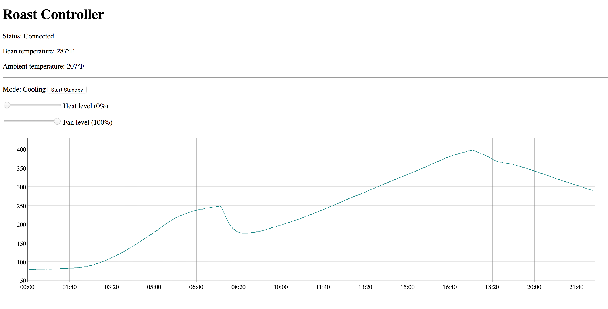

# Bluetop
Bluetooth control module for Hottop coffee roasters

## Introduction
This project contains the source code for powering an after-market modification to Hottop coffee roasters, wherein the control panel is replaced with a custom board using an Adafruit Feather nRF52 to allow the roaster to be controlled via Bluetooth.

The source includes firmware which runs on the nRF52, and a web page which utilizes the Web Bluetooth API to communicate with the nRF52 and provides basic roaster controls.

## Disclaimer
Use at your own risk! Be aware that among other risks, **replacing the roaster control module removes safety features such as shut-off temperature and maximum roast duration**. This project's creator(s) are not responsible for any resulting damages.

## Hardware Specs
* Bluetooth-enabled SoC: https://www.adafruit.com/product/3406
* K-Type thermocouple amplifier: https://www.adafruit.com/product/1778

This project was designed and tested on a Hottop KN-8828B-2K. Since it replaces the entire control panel, it should work on any models that have compatible control panels, but this has not been tested.

(below: finished prototype, including a 2nd thermocouple amplifier and a microphone+amplifier)

## Roasting UI

## License
This project is licensed under the GNU General Public License - see the [LICENSE.md](LICENSE.md) file for details
